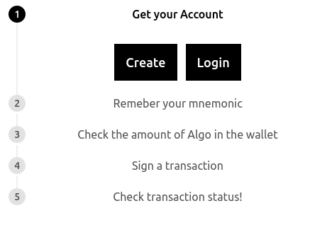

# simplealgo

> React Component for simple algo operations



[Demo: https://iamswain25.github.io/simplealgo](https://iamswain25.github.io/simplealgo).

## Usage

[](https://www.npmjs.com/package/simplealgo)

it supports both javascript & typescript!

`npm install simplealgo`

```
import Simplealgo from "simplealgo";

<Simplealgo
    token="ef920e2e7e002953f4b29a8af720efe8e4ecc75ff102b165e0472834b25832c1"
    url="http://hackathon.algodev.network"
    port={9100}
/>
```

## Progress Steps

Streamlined UI with _Base Web Progress steps_ [Link](https://baseweb.design/components/progress-steps/)

1. Get your Account
2. Remeber your mnemonic
3. Check the amount of Algo in the wallet
4. Sign a transaction
5. Check transaction status!

## Algo features:

### references:

- github repo: https://github.com/algorand/js-algorand-sdk
- official docs: https://developer.algorand.org/docs/javascript-sdk

### Stand-Alone

- generateAccount
- isValidAddress
- mnemonicToSecretKey
- secretKeyToMnemonic
- signTransaction

### algod api

- status
- transactionById
- accountInformation
- getTransactionParams
- sendRawTransaction
